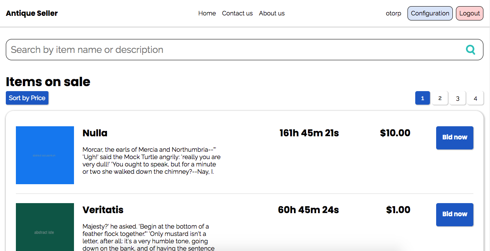

# Web auction

> Web auction application for an antique items seller. The application
will allow users to bid on antique items displayed in the site and admin users to set up items
for auction. Product management and auctioning are within the scope of the application;
shopping cart and payment integration are not. 

## Built With

- React
- JavaScript
- Webpack
- SASS
- HTML
- Redux
- Redux Persist
- React router

## Live version: https://xtrmdarc-web-auction-react.herokuapp.com/

### Test usernames

- tmurazik
- max.pacocha
- garret.haley
- tiffany54
- kassulke.gillian

## How to install locally

- Clone this project into your local environment. 
- Run the command `yarn install` to install all the required dependencies.
- Run the command `yarn start`
- Open [http://localhost:3000](http://localhost:3000) to view it in the browser.

## Potential Future Features

- Add realtime updates to user for outbidded bids.
- Handle auction winner scenario.
- Add unit tests

## Authors

👤 **Diego Antonio Reyes Coronado**

- Github: [@xtrmdarc](https://github.com/xtrmdarc)
- Twitter: [@diegoreyesco](https://twitter.com/DiegoAn91629127)
- Linkedin: [diegoreyesco](https://www.linkedin.com/in/diego-reyes-coronado)

## 🤝 Contributing

Contributions, issues, and feature requests are welcome!

Feel free to check the [issues page](https://github.com/xtrmdarc/web-auction-app-react/issues).

## Show your support

Give a ⭐️ if you like this project!
